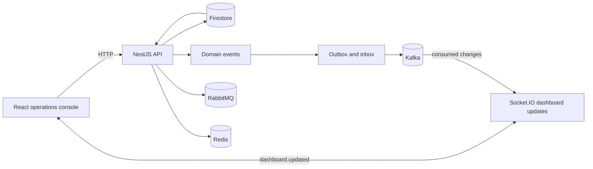

<div align="center">

# GastroFlow

### Operational intelligence for restaurants that run on fresh ingredients

GastroFlow connects the quiet decisions behind a great service: what arrived, what was sold, what was wasted, what needs attention next, and what the team can learn before the next rush.

<p>
  <a href="./gastroflow-api/README.md"></a>
  <a href="./gasroflowui/README.md"></a>
  
  
</p>

<p>
  <a href="#the-product">The product</a> |
  <a href="#how-the-pieces-fit">Architecture</a> |
  <a href="#run-it-locally">Run it locally</a> |
  <a href="#repository-map">Repository map</a>
</p>

</div>

---

## The product

Restaurant operations are a chain of small, high-consequence decisions. A delivery is received. Ingredients move into batches. A recipe is sold. Stock is consumed. Something expires. A manager decides whether to reorder, change a plan, or accept the risk.

GastroFlow turns that chain into a shared operational picture. It gives a restaurant team a place to model inventory, recipes, consumption, waste, recommendations, and simulated scenarios without losing the event trail underneath.

The product is designed around one practical question:

> **Can the team make the next decision with more context than the last one?**

### What GastroFlow brings together

| Product surface | What it helps the team see or do |
| --- | --- |
| Restaurant workspace | Restaurants, locations, and members in one operational boundary |
| Ingredients and batches | What is on hand, where it is, how much remains, and what is at risk |
| Recipes and sales | The relationship between a recipe sale, ingredient consumption, revenue, and margin signals |
| Waste events | Why stock was lost and how the loss changed the remaining batch |
| Recommendations | Actions that can be applied, dismissed, and revisited as conditions change |
| Simulations | Full days, weeks, lunch rushes, deliveries, overbuying, waste spikes, and recommendation strategies |
| Live dashboard | A current summary of inventory, finance, waste, recipes, recommendations, and activity |

This is more than a CRUD application and more grounded than a black-box forecast. The interesting middle is the operational model: explicit events, auditable changes, reproducible scenarios, and decisions a person can understand.

## The operating loop

```text
  Receive stock
       |
       v
  Track batches -----> Record recipe sales
       |                        |
       v                        v
  Detect waste <-------- Update stock movements
       |
       v
  Generate recommendations
       |
       +------> Apply a decision
       |
       +------> Simulate another outcome
                         |
                         v
                 Learn before the next service
```

## How the pieces fit



The repository keeps the product readable from both directions:

- the web console shows the decisions a restaurant operator needs to make;
- the API owns the domain model and the state transitions behind those decisions;
- the event infrastructure gives important changes a path beyond the request that created them.

## What lives here

```text
GastroFlow/
|- gastroflow-api/   Domain API, persistence, events, workers, and tests
|- gasroflowui/      React + Vite operations console
|- src/              Shared or exploratory project material
|- .vscode/          Local development launch configuration
```

The directory name `gasroflowui` is retained for compatibility with the existing project layout.

### API capabilities

The API currently groups behavior into restaurants, ingredients, inventory batches, recipes, stock consumption, waste events, recommendations, dashboard summaries, simulations, and event processing. Its technical home is [gastroflow-api/README.md](./gastroflow-api/README.md).

### Web console

The React console is a focused operator surface rather than a marketing site. It consumes typed API contracts, records recipe sales and waste, shows recommendations, and listens for live dashboard invalidation through Socket.IO. Its local package lives in [gasroflowui/](./gasroflowui/).

## Run it locally

### 1. Start supporting services

```bash
cd gastroflow-api
docker compose up -d
```

This starts Kafka, Redis, and RabbitMQ. RabbitMQ management is available at `http://localhost:15672` with the local `guest` / `guest` credentials from the compose file.

### 2. Start the API

```bash
cd gastroflow-api
npm install
npm run start:dev
```

The API uses Firestore through Firebase Admin. For local work, configure the Firestore emulator and the project ID described in [gastroflow-api/README.md](./gastroflow-api/README.md).

### 3. Start the console

```bash
cd gasroflowui
npm install
npm run dev
```

The console reads `VITE_API_BASE_URL`, `VITE_SOCKET_URL`, and `VITE_DEFAULT_RESTAURANT_ID`. The frontend contract reference is [gasroflowui/docs/API_CONTRACTS.md](./gasroflowui/docs/API_CONTRACTS.md).

## Repository map

| Path | Role | Start here when you want to... |
| --- | --- | --- |
| [`gastroflow-api/`](./gastroflow-api/) | Backend service | Understand domain behavior, persistence, events, or tests |
| [`gastroflow-api/src/modules/`](./gastroflow-api/src/modules/) | Product modules | Add or change a restaurant workflow |
| [`gastroflow-api/src/common/`](./gastroflow-api/src/common/) | Platform services | Work on Firestore, Kafka, RabbitMQ, Redis, or realtime delivery |
| [`gasroflowui/`](./gasroflowui/) | Operations console | Change the operator experience |
| [`gasroflowui/docs/API_CONTRACTS.md`](./gasroflowui/docs/API_CONTRACTS.md) | Frontend contract | Check exactly what the console calls |
| [`gastroflow-api/postman/`](./gastroflow-api/postman/) | API examples | Exercise module workflows manually |

## Engineering character

GastroFlow is also a learning project with production-shaped instincts. The codebase is intentionally exploring:

- domain events and event envelopes;
- Firestore persistence with inbox and outbox boundaries;
- Kafka as a durable change stream;
- RabbitMQ for confirmed asynchronous work and dead-letter handling;
- Redis as a cache and coordination layer;
- Socket.IO for low-latency dashboard invalidation;
- simulations that make operational behavior testable instead of anecdotal.

The goal is not to hide complexity. It is to give each kind of complexity a named place, a useful test, and an observable path through the system.

## Project status

GastroFlow is an active work in progress. The current repository contains a working vertical slice across the API and console, with the infrastructure and domain boundaries being built out deliberately. Expect the contracts and module seams to evolve as the product becomes more complete.

## License

No open-source license has been selected yet. Treat this repository as a private learning and product workspace unless a license is added.
